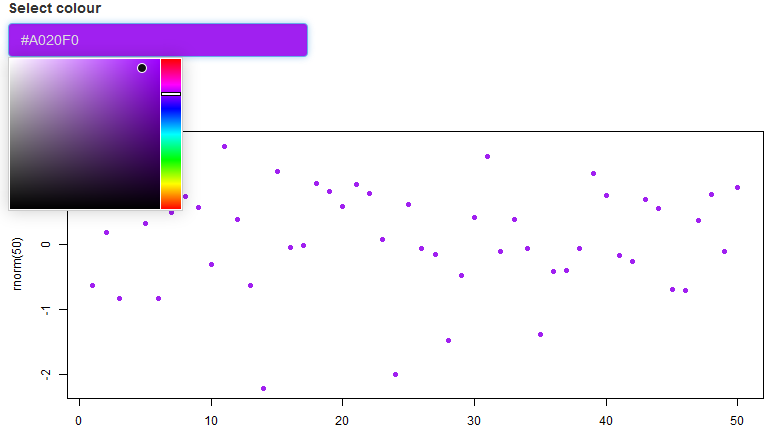
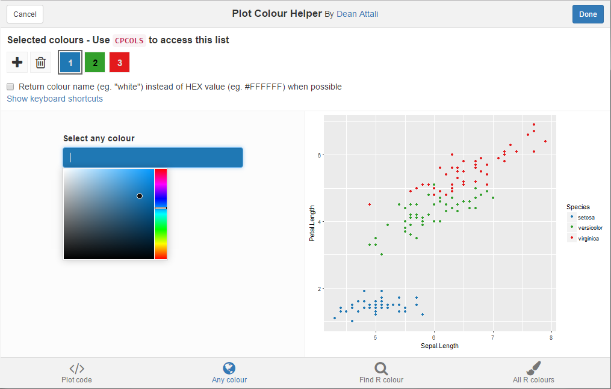
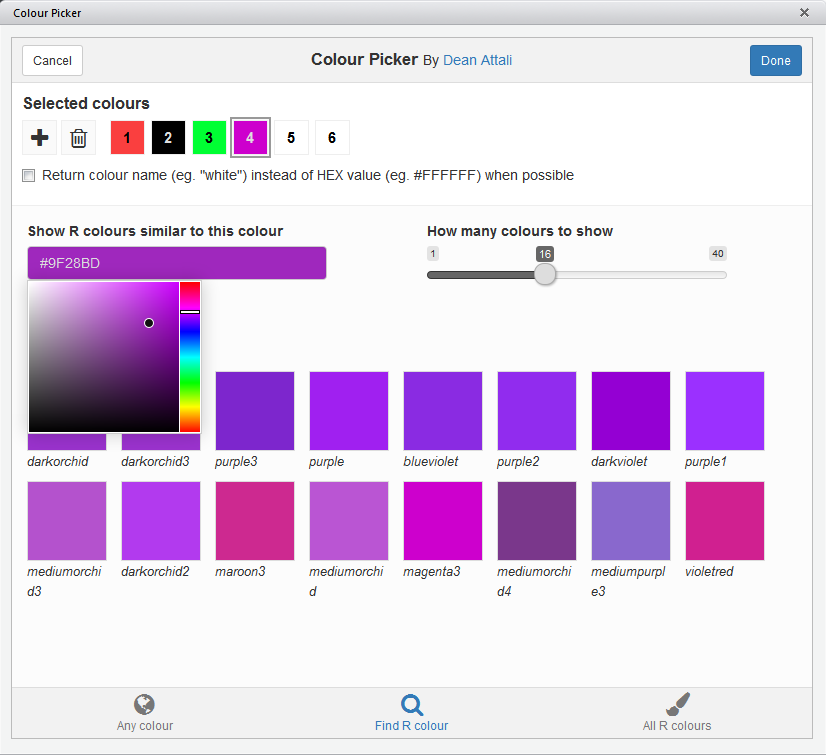
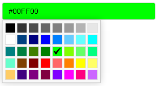

colourpicker - A Colour Picker Tool for Shiny and for Selecting Colours in Plots
================================================================================

> *Copyright 2016 [Dean Attali](http://deanattali.com). Licensed under
> the MIT license.*

`colourpicker` gives you a colour picker widget that can be used in
different contexts in R.

The most common uses of `colourpicker` are to use the `colourInput()`
function to create a colour input, or to use the `plotHelper()`
function/RStudio Addin to easily select colours to use in a plot.

Table of contents
=================

-   [Demos](#demos)
-   [Installation](#install)
-   [Colour input for Shiny apps (or R markdown):
    `colourInput()`](#colourinput)
-   [Select colours to use in your plot: `plotHelper()`](#plothelper)
-   [Select colours to use in your R code:
    `colourPicker()`](#colourpicker)
-   [Features of `colourInput()`](#colourinput-features)
-   [Features of `plotHelper()`](#plothelper-features)

<h2 id="demos">
Demos
</h2>
As mentioned above, the most useful functions are `colourInput()` and
`plotHelper()`. - [Click here](http://daattali.com/shiny/colourInput/)
to view a live interactive demo the colour input. - The GIF below shows
what the Plot Colour Helper looks like.

<h2 id="install">
Installation
</h2>
`colourpicker` is available through both CRAN and GitHub:

To install the stable CRAN version:

    install.packages("colourpicker")

To install the latest development version from GitHub:

    install.packages("devtools")
    devtools::install_github("daattali/colourpicker")

<h2 id="colourinput">
Colour input for Shiny apps (or R markdown): `colourInput()`
</h2>
You can use `colourInput()` to include a colour picker input in Shiny
apps (or in R markdown documents). It works just like any other native
Shiny input, here is an example:

    library(shiny)
    shinyApp(
        ui = fluidPage(
            colourInput("col", "Select colour", "purple"),
            plotOutput("plot")
        ),
        server = function(input, output) {
            output$plot <- renderPlot({
                set.seed(1)
                plot(rnorm(50), bg = input$col, col = input$col, pch = 21)
            })
        }
    )

<h2 id="plothelper">
Select colours to use in your plot: `plotHelper()`
</h2>
If you've ever had to spend a long time perfecting the colour scheme of
a plot, you'd find the Plot Colour Helper handy. It's an RStudio addin
that lets you interactively choose colours for your plot while updating
your plot in real-time so you can see the colour changes immediately.

To use this tool, either highlight code for a plot and select the addin
through the RStudio *Addins* menu, or call the `plotHelper()` function.
The colours selected will be available as a variable named `CPCOLS`.

<h2 id="colourpicker">
Select colours to use in your R code: `colourPicker()`
</h2>
`colourpicker` also provides a more generic RStudio addin that can be
used to select colours and save them as a variable in R. You can either
access this tool using the *Addins* menu or with `colourPicker()`. You
can also watch a [short GIF](inst/img/colourPickerGadget.gif) of it
an action.

Colour input as an 'htmlwidgets' widget
---------------------------------------

The colour picker input is also available as an 'htmlwidgets' widget
using the `colourWidget()` function. This may not be terribly useful
right now since you can use the more powerful `colourInput` in Shiny
apps and Rmarkdown documents, but it may come in handy if you need a
widget.

<h2 id="colourinput-features">
Features of `colourInput()`
</h2>
### Simple and familiar

Using `colourInput` is extremely trivial if you've used Shiny, and it's
as easy to use as any other input control. It was implemented to very
closely mimic all other Shiny inputs so that using it will feel very
familiar. You can add a simple colour input to your Shiny app with
`colourInput("col", "Select colour", value = "red")`. The return value
from a `colourInput` is an uppercase HEX colour, so in the previous
example the value of `input$col` would be `#FF0000` (\#FF0000 is the HEX
value of the colour red). The default value at initialization is white
(\#FFFFFF).

### Allowing "transparent"

Since most functions in R that accept colours can also accept the value
"transparent", `colourInput` has an option to allow selecting the
"transparent" colour. By default, only real colours can be selected, so
you need to use the `allowTransparent = TRUE` parameter. When this
feature is turned on, a checkbox appears inside the input box.

If the user checks the checkbox for "transparent", then the colour input
is grayed out and the returned value of the input is `transparent`. This
is the only case when the value returned from a `colourInput` is not a
HEX value. When the checkbox is unchecked, the value of the input will
be the last selected colour prior to selecting "transparent".

By default, the text of the checkbox reads "Transparent", but you can
change that with the `transparentText` parameter. For example, it might
be more clear to a user to use the word "None" instead of "Transparent".
Note that even if you change the checkbox text, the return value will
still be `transparent` since that's the actual colour name in R.

This is what a colour input with transparency enabled looks like

### How the chosen colour is shown inside the input

By default, the colour input's background will match the selected colour
and the text inside the input field will be the colour's HEX value. If
that's too much for you, you can customize the input with the
`showColour` parameter to either only show the text or only show the
background colour.

Here is what a colour input with each of the possible values for
`showColour` looks like

### Updating a colourInput

As with all other Shiny inputs, `colourInput` can be updated with the
`updateColourInput` function. Any parameter that can be used in
`colourInput` can be used in `updateColourInput`. This means that you
can start with a basic colour input such as
`colourInput("col", "Select colour")` and completely redesign it with

    updateColourInput(session, "col", label = "COLOUR:", value = "orange",
      showColour = "background", allowTransparent = TRUE, transparentText = "None")

### Limited colour selection

This feature is available in `shinyjs` v0.0.8.0, which is currently only
on GitHub and not on CRAN.

If you want to only allow the user to select a colour from a specific
list of colours, rather than any possible HEX colour, you can use the
`palette = "limited"` parameter. By default, the limited palette will
contain 40 common colours, but you can supply your own list of colours
using the `allowedCols` parameter. Here is an image of the default
limited colour palette.

### Flexible colour specification

Specifying a colour to the colour input is made very flexible to allow
for easier use. When giving a colour as the `value` parameter of either
`colourInput` or `updateColourInput`, there are a few ways to specify a
colour:

-   Using a name of an R colour, such as `red`, `gold`, `blue3`, or any
    other name that R supports (for a full list of R colours, type
    `colours()`)
-   If transparency is allowed in the `colourInput`, the value
    `transparent` (lowercase) can be used. This will update the UI to
    check the checkbox.
-   Using a 6-character HEX value, either with or without the leading
    `#`. For example, initializing a `colourInput` with any of the
    following values will all result in the colour red: `ff0000`,
    `FF0000`, `#ff0000`.
-   Using a 3-character HEX value, either with or without the leading
    `#`. These values will be converted to full HEX values by
    automatically doubling every character. For example, all the
    following values would result in the same colour: `1ac`, `#1Ac`,
    `11aacc`.

### Works on any device

If you're worried that maybe someone viewing your Shiny app on a phone
won't be able to use this input properly - don't you worry. I haven't
quite checked every single device out there, but I did spend extra time
making sure the colour selection JavaScript works in most devices I
could think of. `colourInput` will work fine in Shiny apps that are
viewed on Android cell phones, iPhones, iPads, and even Internet
Explorer 8+.

<h2 id="plothelper-features">
Features of `plotHelper()`
</h2>
### Addin vs gadget

The Plot Colour Helper is available as both a gadget and an RStudio
addin. This means that it can be either invoked through the *Addins*
menu, or as a function (`plotHelper()`). There is a small difference
between the two: invoking the addin via `plotHelper()` will merely
return the final colour list as a vector, while using the *Addins* menu
will result in the entire plot code and colour list getting inserted
into the document.

### Initial plot code can be either text or code

If you use the `plotHelper()` function, the first parameter is the code
for a plot. This code can either be in the form of text, or it can be
real code. For example, both of the following are valid:

    plotHelper( ggplot(mtcars, aes(mpg, wt)) + geom_point(col = CPCOLS) )
    plotHelper("ggplot(mtcars, aes(mpg, wt)) + geom_point(col = CPCOLS)")

### Default plot if no code provided

To more easily access the tool, you can call `plotHelper()` with no
parameters or select the addin without highlighting any code. In that
case, the default code in the tool will be initialized as

    ggplot(iris, aes(Sepal.Length, Petal.Length)) +
          geom_point(aes(col = Species)) +
          scale_colour_manual(values = CPCOLS)

You can always change the plot code from within the tool.

### Initial list of colours

You can set the initial colour list by providing a vector of colours as
the `colours` parameter of `plotHelper()` (eg. \`plotHelper(code,
colours = c("red", "\#123ABC"))).

Alternatively, if you don't want to initialize to any particular set of
colours, but you want to initialize with a specific number of colours in
the list, you can provide an integer as the `colours` parameter (eg.
\`plotHelper(code, colours = 2)).

If the colour list is not provided, then a default palette of colours
will be used for the initial colours. This palette has 12 colours, and
if there are more than 12 colours to support then they will repeat.

### Plot Colour Helper tries to guess how many colours are needed

If you don't provide the `colours` parameter, or if you invoke the tool
as an addin, it will attempt to guess how many colours are needed. For
example, using the following plot code

    ggplot(mtcars, aes(wt,mpg)) +
        geom_point(aes(col = as.factor(am))) +
        scale_colour_manual(values = CPCOLS)

will initialize the tool with 2 colours (because there are 2 `am`
levels), while the following code

    ggplot(mtcars, aes(wt,mpg)) +
        geom_point(aes(col = as.factor(cyl))) +
        scale_colour_manual(values = CPCOLS)

will use 3 colours.

### Keyboard shortcuts

There are several keyboard shortcuts available, to make the selection
process even simpler. **Spacebar** to add another colour, **Delete** to
remove the currently selected colour, **Left**/**Right** to navigate the
colours, and more. You can view the full list of shortcuts by clicking
on *Show keyboard shortcuts*.

### Return value of Plot Colour Helper

When the tool is run as an addin, the code along with the final colour
list get inserted into the currently selected RStudio document (either
the Source panel or the Console panel).

If the tool is called with `plotHelper()`, then the return value is
simply the vector of selected colours.

Since the plot code requires you to use the variable name `CPCOLS`,
after closing the plot helper tool, a variable named `CPCOLS` will be
available in the global environment.

The colours returned can either be in HEX format (eg. "\#0000FF") or be
named (eg. "blue") - you can choose this option inside the tool.
